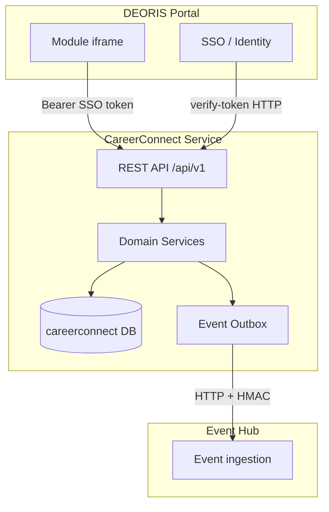

# CareerConnect — SOA Architecture

CareerConnect is an **independent microservice** in the DEORIS ecosystem. It follows service-oriented architecture (SOA) boundaries: own data, own logic, API/event integration only.

## Architecture diagram



## SOA requirements compliance

| Requirement | Implementation |
|-------------|----------------|
| **Own database** | Dedicated MySQL schema `careerconnect` (`DB_DATABASE`). `AssertServiceBoundary` middleware rejects forbidden shared names. |
| **Isolated business logic** | `app/Services/Domain/*` — domain rules stay inside the service. Controllers are thin HTTP adapters. |
| **REST APIs** | Versioned `GET/POST /api/v1/*`. Discovery: `/api/v1/service/manifest`, `/api/v1/service/openapi`. |
| **APIs/events only** | Outbound: Portal HTTP (auth), Event Hub HTTP (async). No direct DB links to other services. |
| **Portal authentication** | `PortalAuthClient` → `DeorisPortalAuthClient` validates Bearer tokens with the portal. |
| **Independently deployable** | Standalone Laravel app, `docker-compose.yml`, health at `/api/health`. |
| **No shared database** | Local `faculty_users` is an SSO profile cache, not the portal user store. |
| **Loose coupling** | Contracts (`PortalAuthClient`, `EventPublisher`) + transactional outbox pattern. |

## Integration boundaries

### Inbound (allowed)

| Source | Method | Purpose |
|--------|--------|---------|
| DEORIS Portal | `Authorization: Bearer {sso_token}` | Faculty authentication |
| Browser (module) | REST `/api/v1/*` | UI operations |
| Dev (local only) | `Bearer dev:{sso_id}` | Local testing |

### Outbound (allowed)

| Target | Method | Purpose |
|--------|--------|---------|
| DEORIS Portal | `GET /api/v1/verify-token` | Token validation |
| Event Hub | `POST /events` | Domain event propagation |

### Forbidden

- Reading or writing portal, student, or other module databases
- Synchronous coupling to other microservices (use Event Hub)
- Local password authentication for faculty

## Event outbox pattern

1. Domain action creates `event_outbox` row in the **same DB transaction** as business data.
2. `PublishEventToHub` job calls `EventPublisher` (Event Hub HTTP).
3. HMAC-SHA256 signature on payload; `X-Service-Key` identifies the source service.
4. Retries with exponential release (5 attempts).

## Service discovery

```bash
GET /api/health
GET /api/v1/service/manifest
GET /api/v1/service/openapi
```

Response headers on all API routes:

- `X-DEORIS-Service: careerconnect-service`
- `X-DEORIS-Service-Version: 1.0.0`
- `X-DEORIS-Api-Version: v1`

## Configuration

```env
DB_DATABASE=careerconnect
APP_PORTAL_URL=https://deoris.test
EVENT_HUB_URL=http://event-hub.local/api/v1
EVENT_HUB_SECRET=...
CAREERCONNECT_SERVICE_KEY=...
CAREERCONNECT_SERVICE_NAME=careerconnect-service
```

## Independent deployment

```bash
docker compose up -d
# or
php artisan migrate --force
php artisan serve
php artisan queue:work
```

See [SETUP.md](./SETUP.md) for production deployment.
