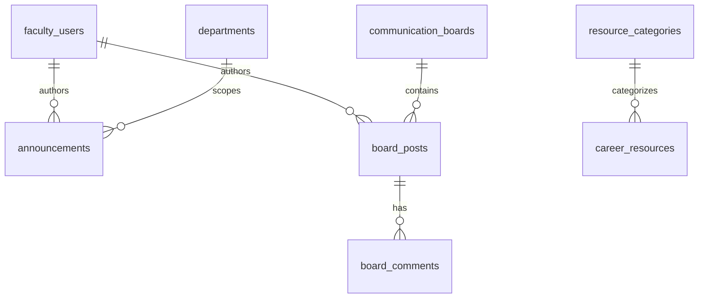

# CareerConnect Database Schema

**Ownership:** CareerConnect exclusively owns the `careerconnect` MySQL database.  
**Rules:** No cross-service joins, no shared schemas, migrations isolated to this service.

## Tables

| Table | Purpose |
|-------|---------|
| `faculty_users` | SSO-mapped faculty profiles (local cache) |
| `departments` | Department coordination |
| `announcements` | Institutional notices |
| `communication_boards` | Collaboration channels |
| `board_posts` | Board threads |
| `board_comments` | Nested discussion comments |
| `career_resources` | Career guidance materials |
| `resource_categories` | Resource taxonomy |
| `notifications` | User notifications |
| `message_threads` | Secure faculty messaging |
| `messages` | Encrypted thread messages |
| `activity_logs` | Audit trail |
| `event_outbox` | SOA event delivery queue |
| `access_attempts` | Auth monitoring / student blocks |
| `sessions` | API session storage |

All core entities use **foreign keys**, **indexes**, **timestamps**, and **soft deletes** where noted in migrations.

## SQL views

| View | Purpose |
|------|---------|
| `v_faculty_activity_summary` | Faculty action aggregates |
| `v_department_announcement_analytics` | Per-department announcement metrics |
| `v_communication_engagement` | Board post/comment engagement |
| `v_announcement_delivery_stats` | Announcement + notification reach |
| `v_resource_usage_analytics` | Resource downloads/views by category |

## Stored procedures

| Procedure | Parameters |
|-----------|------------|
| `sp_faculty_activity_report` | `department`, `days` |
| `sp_announcement_delivery_stats` | `announcement_id` (nullable) |

## Triggers

| Trigger | Action |
|---------|--------|
| `trg_board_post_increment_board_count` | Updates `communication_boards.posts_count` |
| `trg_board_comment_increment_post_count` | Updates `board_posts.comments_count` |

## ER diagram (simplified)

